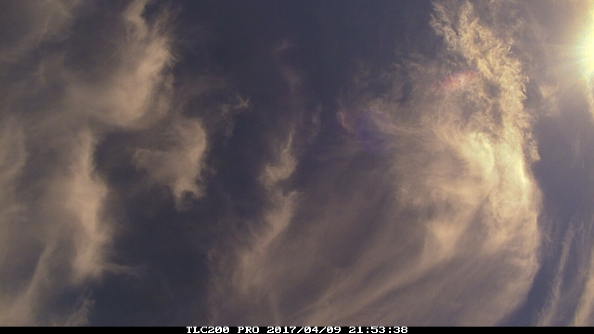

bcc200-ocr
==========

Read timestamp from BCC200 camera images. The timestamp is output as an ISO 8601
string (`YYYY-mm-ddTHH:MM:SS`).

Requirements
------------

- Python 2.7
- numpy
- scipy

Usage
-----

The script expects the `aux` directory to be present in the current working
directory.

Image size is expected to be 1280 ⨉ 720 pixels.

### Command line

    bcc200_ocr input

- `input` - input file

### Python

    bcc200_ocr(input)

- `input` - input file

Example
-------

**example.jpg:**

    bcc200_ocr example.jpg
    2017-04-09T21:53:38

License
-------

[MIT](LICENSE.md)
